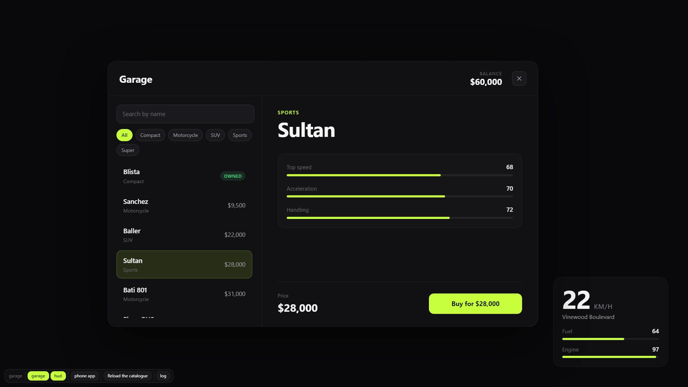
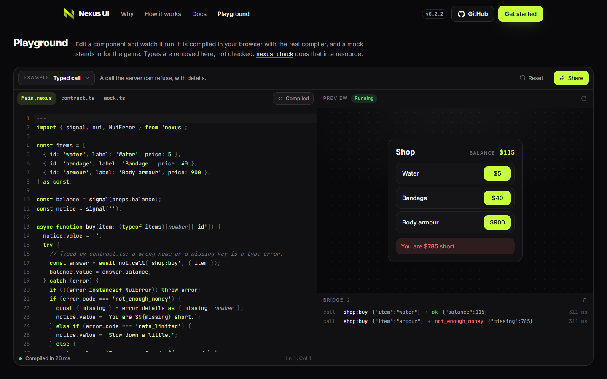
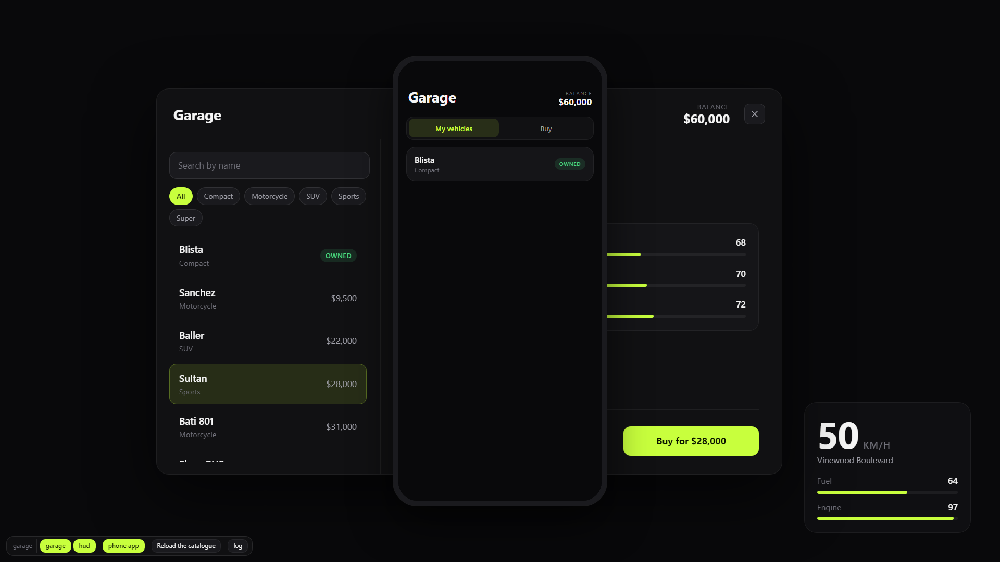

# Nexus UI

A UI framework for FiveM resources. You write components in `.nexus` files, declare every
message between the page and Lua once, and get a page that costs nothing while it is closed and
a server that only ever sees input it has already validated.



*The example resource in a browser under `nexus dev`: a screen, a HUD fed by state, and the
toolbar that opens screens and shows what crosses the bridge.*

```nexus
---
import { signal, nui, t } from 'nexus';

interface Props {
  item: string;
  price: number;
}

const amount = signal(1);

async function buy() {
  const { balance } = await nui.call('shop:buy', { item: props.item, amount: amount.value });
}
---

<screen focus="mouse keyboard" close="escape" size="1920x1080" />

<section class="shop" class:busy={nui.pending('shop:buy')}>
  <h1>{t('shop.title')}</h1>
  <input type="number" bind:value={amount} min="1">
  <button on:click={buy}>{t('shop.buy')}</button>
</section>

<style>
  .shop.busy { opacity: 0.6; }
</style>
```

```lua
-- server/main.lua
Nexus.handle('shop:buy', function(source, data)
    -- data is { item = string, amount = 1..100 } and nothing else. The contract saw to that.
    return { ok = true, balance = 120 }
end)

-- client/main.lua
RegisterCommand('shop', function()
    Nexus.open('shop', { item = 'water', price = 5 })
end, false)
```

## What it is

- **A component format.** `.nexus` files hold TypeScript, markup and scoped CSS. The compiler
  turns each into a small module that updates the DOM directly: no virtual DOM, and a component's
  code runs once.
- **A typed bridge to Lua.** `web/contract.ts` declares the calls, pushes, client messages and
  state. From it come the types of `nui` in the page, the Lua validators and rate limits on the
  server, and the checks of the browser mock.
- **Screens.** A file in `web/screens` is a screen that Lua opens by name. Its `<screen>` tag
  declares focus, Escape and design size, so no Lua touches `SetNuiFocus`. A screen's code is
  loaded when it is first opened, and with nothing open the page has no nodes and runs nothing.
- **Apps for LB Phone and LB Tablet.** A screen with `surface="phone"` or `surface="tablet"` is
  an app in LB's phone or tablet, served by the same build and the same contract. One line of
  Lua registers it.
- **Screens on props.** A screen with `surface="world"` is drawn on a texture in the game world:
  a monitor, a time clock, a kiosk. One line of Lua creates it, another lets the player use it
  with the mouse and the keyboard.
- **Tooling.** `nexus create` for a working resource, `nexus dev` for a browser with a mock in
  place of the game and hot reload, `nexus build` for Chromium 103, `nexus check` for types and
  for what FiveM's browser cannot run.

The Lua side is two standalone files. It needs no framework and no library, and runs next to
ESX, QBCore, Qbox or nothing.

## Why it exists

A NUI is a web page in a browser from 2022, talking to a game through untyped messages, on a
server where any client may be hostile. The usual stack leaves each of those to the resource
author:

- The page and Lua agree on message names and shapes by convention, so a typo is found in game.
- Server events that the UI triggers are validated by hand, or not at all.
- Focus, Escape and cleanup are rewritten in every resource, and a missed case leaves a player
  with a stuck cursor.
- CSS and JavaScript that work in a current browser fail silently in Chromium 103.
- A closed UI still runs its framework, and a HUD sends more than changed.

Nexus UI takes those on as the framework's job.

## Start

```
npm create nexus-ui my_shop
cd my_shop
npm install
npm run dev
```

`npm run dev` opens the UI in a browser. `npm run build` writes the page and the Lua bridge,
after which `ensure my_shop` starts the resource and `/my_shop` opens its screen.

The package is [`@nexusstudios/ui`](https://www.npmjs.com/package/@nexusstudios/ui) on npm. To add it to a
resource that exists already: `npm install --save-dev @nexusstudios/ui`.

Requirements: Node.js 20 or newer, and `lua54 'yes'` in the resource.

## Documentation

The site has the documentation with search and a playground that compiles and runs `.nexus`
code in the browser: **[nexusstudios-ui.vercel.app](https://nexusstudios-ui.vercel.app)**.

[](https://nexusstudios-ui.vercel.app/playground/)

The same documents live in this repository:


- [Guide](docs/guide.md): from `nexus create` to a working screen, step by step.
- [The `.nexus` format](docs/format.md): every block and directive.
- [The bridge](docs/bridge.md): the contract, the Lua API, the security model, the wire format.
- [The command line](docs/cli.md): `create`, `dev`, `build`, `check`.
- [Roadmap](docs/roadmap.md): what version 0.3 does not do.
- [Changelog](CHANGELOG.md): what changed in each release.

`examples/garage` is a complete resource: a garage menu with a list, a search and a purchase the
server can refuse, a vehicle HUD, the same garage as an app in LB Phone, sounds and two
languages. `examples/world` is a small one: a screen on a prop, and a command that tests in
game that every link between that screen and Lua holds.



[Nexus Shop](https://github.com/NexusStudiosCfx/nexus_shop) is a second example, in a repository
of its own: a store clerk, an ox_target option and a basket with ox_inventory items, paid in cash
or by card. Its release has a zip that runs as it is.

`editor/vscode` is a VS Code extension with syntax highlighting and snippets for `.nexus` files.

## License

MIT
